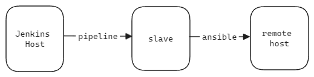
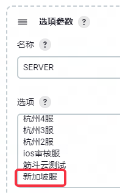
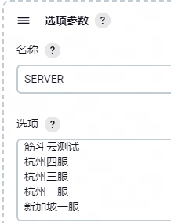
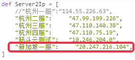

# Jenkins运维工具说明

[TOC]

## 一些Jenkins Pipeline QA

### Jenkins集成ansible执行框架
所有使用到ansible的Jenkins job执行流程都是在ops_server上执行的，每条pipeline都有下面一条指令标识在哪一台机器上执行。
```
agent { label 'ops_server' }
```
**Jenkins Pipeline在ops_server这台机器上调用ansible-playbook在远程机器上执行一系列的预定义的自动化任务**。具体的执行逻辑写在ansible-playbook中，Jenkins所做的工作为接受用户参数并作相应处理，再将其传递给ansible-playbook，最后再将处理结果通知给用户。


### 为什么要拿到远程主机的hostname?
大多数Jenkins Pipeline 有以下一条命令获取远程主机的hostname：
```
HOST = sh(script: "${CMD_PREFIX} hostname", returnStdout: true).trim()
```
执行ansible-playbook需要通过-l指定远程主机，**每个远程机器都通过一个标识来映射到其Ip**，这个标识在host配置文件中被设置为该机器的hostname。
```
luobing-test  ansible_host=10.246.204.0  private_ip="{{ ansible_host }}"
```

### 如何查看或更改ansible脚本
1. 可以通过server/tools/Jenkins/ansible_playbooks目录下查看ansible脚本.
2. 真正执行的ansible脚本在ops_server机器上的/home/jenkins-l28/ansible/playbooks目录下, 若需更改需要有Jenkins-l28的用户权限或者联系SA.

---

## aladdin_test_env
### 作用
运维流程一体化工具，包含服务器引擎编译，中转服代码推送，服务器停服、更新、起服功能。aladdin_test_env通过调用另外三个Jenkins job来完成上诉提到的功能，其中对应关系为：
* 服务器引擎编译：**server_engine_build**
* 中转服代码推送：**sync_server_code**
* 服务器停服、更新、起服：**server_control_pipeline**

---

## server_engine_build

### 作用
用于编译服务器引擎

### 工作流程 
1、检查链接并检出代码
2、拉起容器并编译引擎
3、停止容器并删除容器

### 运行出错检查
* 一般是docker镜像拉取失败或者删除失败导致，可以检查一下docker仓库有没有过期或者为什么容器删除失败。

---

## sync_server_code
### 作用
过滤仓库代码并上传至中转服务器
### 工作流程 
1. 检查链接是否包含指定目录
2. 执行sync_server_code.py文件
   1. 检出指定目录下的文件；
   2. 依据同目录下的rsync过滤规则文件（rsync_pattern.txt）将文件同步至中转服务器；
   3. 记录检出代码的版本号到svn_revision.txt并同步到中转服务器用于版本号比对.

### 运行出错检查
* 确保输入的链接正确
* 版本号比对不正确，检查sync_server_code.py代码中的版本号获取指令

### 文件过滤规则修改
参考confluence中[此篇文章](https://confluence.leihuo.netease.com/pages/viewpage.action?pageId=292352810)

---

## Server_Control_Pipeline
### 作用
调用对应ansible-playbook脚本,控制服务器的停服、更新、起服。
#### 调用ansible脚本
**停服脚本**:game_stop_alone_process_try.yml
**更新脚本**:game_pull_app_code.yml
**起服脚本**:game_start_alone_process_try.yml
### 工作流程 
调用ops_server上的ansible-playbook脚本，控制服务器的停服、更新、起服。
* **停服逻辑**：
  * 拉起一个容器运行inner_gm进程，向switch发送echo down指令;
  * 循环等待所有进程关闭，若等待超时，则强制关闭所有容器。
* **更新逻辑**：
  * 通过rsync从中专服务器同步项目代码到/mnt/data文件夹下;
  * 若用户输入了版本号，则会验证同步代码的版本号。
* **起服逻辑**：
  * 拉起一个容器运行gen_config.sh，在server/etc/service_list文件夹下生成yml文件;
  * 根据yml文件记录的进程名和启动命令生成一个docker_compose.yml文件;
  * 调用docker compose up -d 命令拉起服务器;
  * 调用check_nohup.py查看所有进程是否启动成功, 若启动失败则输出未启动成功的进程名.
### 运行出错检查
  * 若是database进程未成功启动, 则一般是数据未更新, 更新数据库后重启即可;

### 增加服务器
若需要增加新服务器, 则需要到Aladdin_test_env中更改相应配置, 以下以新加坡服为例
1、配置->参数化构建->在SERVER一栏中添加"新加坡服";

2、配置->流水线->在Server2Ip添加服务器名（这里的服务器名需要和步骤一中的一致）和IP地址;
3、配置->流水线->在Server2Sync添加服务器名(这里的服务器名需要和步骤一中的一致)和中转服务器名, 用于指定服务器到何处同步代码;
4、联系SA给予该服务器到中转服务器拉取代码的权限

---

## opera_single_process
### 作用
通过docker-compose.yml文件启动或关闭单个进程.
#### 调用ansible脚本
game_opera_single_process.yml.
### 工作流程 
1、拉起容器生成配置文件(可选)
2、拉起或关闭单个进程 `docker-compose up(stop) {process_name}` 
3、检查进程是否拉起或关闭成功
### 运行出错检查
* 确保能够成功拉取镜像
* 若扩容拉起新的进程, 则需先修改server/etc下的配置文件, 再重新生成docker-compose.yml文件, 再拉起容器。
### 扩容步骤
1. 修改配置文件, 提交到分支;
2. 运行aladdin_test_env, 勾选[**同步至中心服务器**]和[**服务器更新**]选项(不要勾选停服或起服)
3. 运行opera_single_process, 一定要勾选[**重新生成配置文件**]

### 增加服务器
参考Server_Control_Pipeline增加服务器的前两步.

---

## update_database
### 作用
用于更新指定服务器连接的数据库.
#### 调用ansible脚本
mysql-import-change-schema.yml

### 工作流程
1. 拉取docker镜像
2. 在容器中执行get_host_db.lua
   1. get_host_db.lua会从server\etc\auto_distributed_deployment下的配置文件获取服务器连接的**数据库Ip:Port**
3. 根据数据库Ip:Port读取ansible mysql.yml配置文件获取数据库密钥，连接数据库并执行sql文件。

### 运行出错检查
1、确保docker镜像拉取成功；
2、确保服务器连接的数据库Ip和Port在auto_distributed_deployment中正确配置；
3、确保数据库密钥在ansible配置文件中正确配置。

### 增加服务器
以增加新加坡服为例
1、配置->参数化构建->在SERVER一栏中添加"新加坡一服";

2、配置->流水线->在Server2Ip添加服务器名（这里的服务器名需要和步骤一中的一致）和IP地址;

3、可以先运行一次，若连接的是新数据库，会出错，此时联系SA在ansible文件中添加数据库的密钥。（可以在console output中查看连接的数据库Ip和Port）


---

## push_docker_image

### 作用
用于推送docker镜像到微软云或阿里云镜像仓库.

### 工作流程
1. 检查推送的docker镜像是否存在;
2. 给推送的镜像加上私有仓库前缀;
3. 登录私有仓库, 推送镜像, 登出仓库.

### 注意事项
在指定推送的镜像时,如果随送的镜像有其他私有仓库的前缀, 需要先手动将镜像的前缀去除, 例如:需要推送一个仓库镜像到另外一个仓库, 镜像名为 `docker-registry-test.l28.netease.com:5000/db_update_env:latest`时, 需要先运行tag命令去掉镜像的仓库前缀, 接着再输入推送镜像名`db_update_env:latest`即可.
```
docker tag docker-registry-test.l28.netease.com:5000/db_update_env:latest db_update_env:latest
```