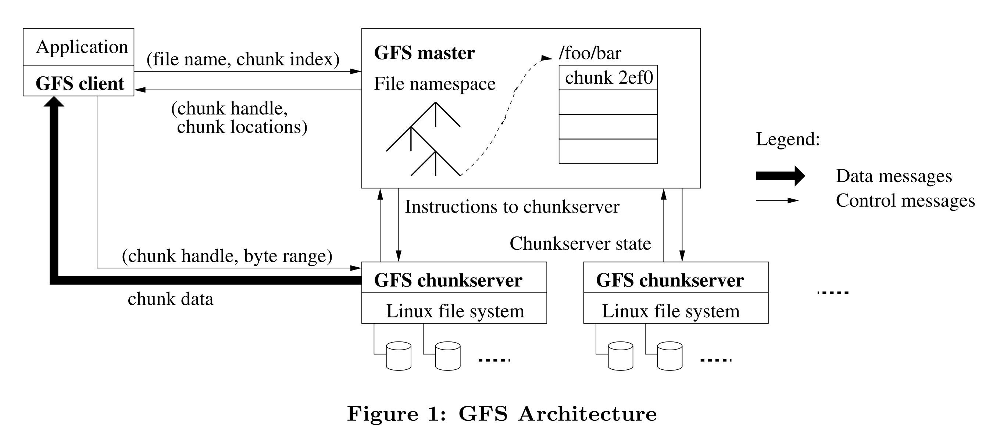
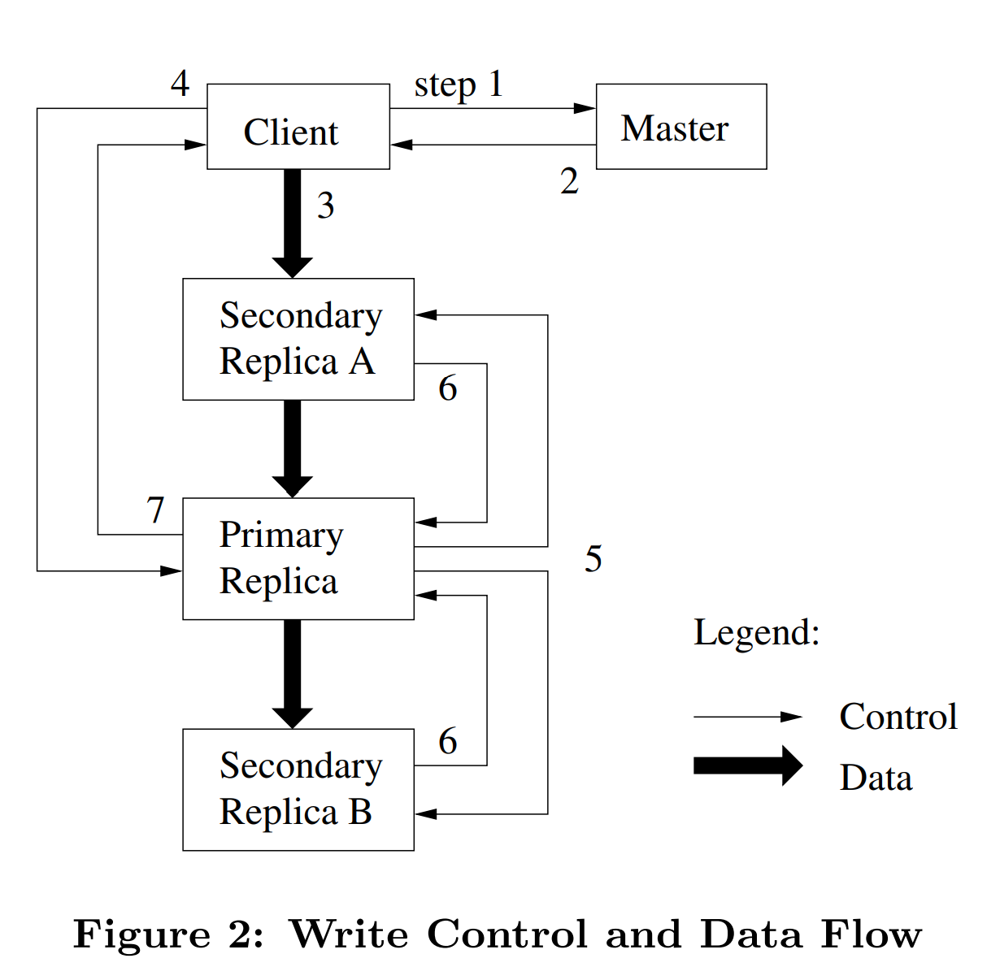
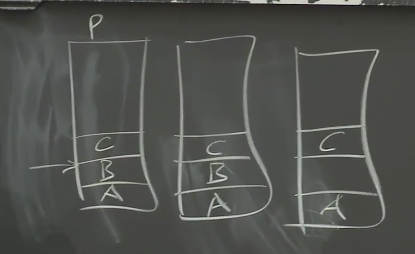
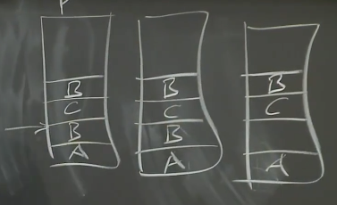

# GFS

## 分布式存储的难点

1. 为了同时利用数百台计算机资源并发完成大量工作，人们将数据分割到大量服务器上，这样就可以并行的从多台服务器读取数据。这种方式称之为**分片（Sharding）**。
2. 当在成百上千的服务器进行分片，总有会出现常态化的故障，人们需要自动化的方法而不是人工介入的方式来修复错误，这就引出了**容错（fault tolerance）**。
3. 实现容错最有用的一种方法是使用复制，只需要维护2-3个数据副本，当其中一个故障了，你就可以使用另一个。所以，如果想要容错能力，就得有**复制（replication）**。
4. 当引入了复制，存在多个数据副本，很有可能会出现 **数据不一致（inconsistency）** 的问题，而获取到的数据内容也将取决于你向哪个副本请求数据。这会对应用程序造成麻烦。

## GFS的设计目标

Google的目标是构建一个大型的，快速的文件系统。并且这个文件系统是**全局有效**的，这样各种不同的应用程序都可以从中读取数据，GFS 在实现目标是对写入操作的吞吐量，因而减少了对一致性的约束。

一种构建大型存储系统的方法是针对某个特定的应用程序构建特定的裁剪的存储系统。但是如果另一个应用程序也想要一个大型存储系统，那么又需要重新构建一个存储系统。

如果有一个全局通用的存储系统，那就意味着如果我存储了大量从互联网抓取的数据，你也可以通过申请权限来查看这些数据，因为我们都使用了同一个存储系统。任何在Google内部的人员都可以根据名字读取这个文件系统（GFS）中可被共享的内容。

* 为了获得大容量和高速的特性，**每个包含了数据的文件会被GFS自动的分割并存放在多个服务器之上**（分片），这样读写操作自然就会变得很快（读写分离）。
* GFS被设计成只在一个数据中心运行，并没有将副本保存在世界各地，**单个GFS只存在于单个数据中心的单个机房里**。理论上来说，数据的多个副本应该彼此之间隔的远一些，但是实现起来挺难的，所以GFS局限在一个数据中心内。
* GFS在各个方面对大型的顺序文件读写做了定制。GFS是为TB级别的文件而生。**GFS只会顺序处理，不支持随机访问**。GFS并没有花费过多的精力来降低延迟，它的关注点在于巨大的吞吐量上，所以单次操作都涉及到MB级别的数据。

## GFS master节点

GFS中存在一个 master 节点和多个 server 节点，**Master节点用来管理文件和Chunk的信息，而Chunk服务器用来存储实际的数据**。通过这样设计GFS将两类数据的管理问题隔离。

**Master节点知道每一个文件对应的所有的Chunk的ID**，这些Chunk每个是64MB大小。

### master节点存储数据

* ==**文件名**到 **Chunk ID** 或者 **Chunk Handle** 数组的映射== 。
* ==**Chunk ID** 到 **Chunk 数据**的对应关系==，包含了以下数据：
  * **一个服务器（server）列表**，记录了 Chunk ID 对应的 Chunk 数据存储在哪些服务器上。
  * **Chunk 当前的版本号**。
  * **持有 Primary Chunk 的 Chunk server**，对于Chunk的写操作都必须在Primary Chunk 上顺序处理，Primary Chunk是Chunk的多个副本之一。
  * **Primary Chunk的租约过期时间**，Primary Chunk 只能在特定的租约时间内担任 Primary Chunk。

### 持久化数据

master节点的数据都存储在内存中，如果Master故障了，这些数据就都丢失了。==为了能让Master重启而不丢失数据，Master节点会同时将数据存储在磁盘上==。

* non-volatile（非易失，储存到磁盘）
  * **文件名**到 **Chunk ID** 或者 **Chunk Handle** 数组的映射；
  * **Chunk 数据的版本号**；

* volatile（易失，不存储到磁盘）
  * **主Chunk的ID**，Master节点重启之后会忘记谁是主Chunk，在等待租约到期后，Master节点可以安全指定一个新的主Chunk。
  * **租约过期时间**
  * **Chunk服务器列表**，该信息不用保存到磁盘，因为Master节点重启之后可以与所有的Chunk服务器通信，并查询每个Chunk服务器存储了哪些Chunk

当文件扩展到达了一个新的64MB，需要新增一个Chunk或者由于指定了新的主Chunk而导致版本号更新了，Master节点需要向磁盘中的Log追加一条记录说，我刚刚向这个文件添加了一个新的Chunk或者我刚刚修改了Chunk的版本号。

磁盘中维护log而不是数据库的原因是，数据库本质上来说是某种B树（b-tree）或者hash table，相比之下，追加log会非常的高效，因为你可以将最近的多个log记录一次性的写入磁盘，因为这些数据都是向同一个地址追加，这样只需要等待磁盘的磁碟旋转一次。而对于B树来说，每一份数据都需要在磁盘中随机找个位置写入。（**顺序读写优于随机读写**）

当Master节点故障重启，并重建它的状态，你不会想要从log的最开始重建状态，因为log的最开始可能是几年之前，所以 Master 节点会在磁盘中创建一些checkpoint点，这可能要花费几秒甚至一分钟。这样Master节点重启时，会从 log 中的最近一个checkpoint开始恢复，再逐条执行从 checkpoint 开始的log，最后恢复自己的状态。（**checkpoint 类似于 redis 的 RDB 内存快照**）

## GFS读文件（Read File）

1. 客户端向 master 节点发送**文件名以及读取位置的偏移量**
2. Master 节点会从自己的 file 表单中查询文件名，得到 Chunk ID 的数组。因为每个 Chunk 是64MB，所以偏移量除以64MB就可以从数组中得到对应的 **Chunk ID**。
3. Master 从 Chunk 表单中找到存有 Chunk 的**服务器列表**，并将列表返回给客户端。
4. 客户端从 Chunk 服务器列表中挑选一个来读取数据，客户端会选择一个网络上最近的服务器（Google的数据中心中，IP地址是连续的，所以可以从IP地址的差异判断网络位置的远近）。
5. 客户端将 Chunk Handle 和偏移量发送给 Chunk 服务器。
6. Chunk服务器根据文件名找到对应的Chunk文件，从文件中读取对应的数据段，并将数据返回给客户端。

如果如果读取的数据超过了一个Chunk怎么办？
应用程序会通过一个库来向GFS发送RPC，而这个库会注意到这次读请求会跨越Chunk边界，**因此会将一个读请求拆分成两个读请求再发送到Master节点**，并得到了两个返回结果，之后再向两个不同的Chunk服务器读取数据。

## GFS写文件（Write File）

对于读文件来说，可以从任意 Chunk 副本读取数据，但是对于写文件来说，必须要通过 Chunk的主副本（Primary Chunk）来写入。

对于 Master 节点，如果发现 Chunk 主副本不存在，Master会找出所有存有 Chunk 最新副本的 Chunk 服务器（**最新的副本是指，副本中保存的版本号与Master中记录的Chunk的版本号一致**）。

    提问：为什么不以 Chunk 服务器上保存的最大版本号作为最新版本号？
当存储最新版本号的 Chunk 服务器因为宕机或者其他原因延迟启动，master 服务器会把一个旧版本号的 Chunk 当作最新版本号。

---

当客户端想要对文件进行追加，但是又不知道文件尾的Chunk对应的Primary在哪时，Master会等所有存储了最新Chunk版本的服务器集合完成，然后挑选一个作为Primary，其他的作为Secondary。

之后Master会增加版本号，并将版本号写入磁盘。Master 节点会向 Primary 和Secondary 副本对应的服务器发送消息并告诉它们，谁是Primary，谁是Secondary，Chunk的新版本是什么。Primary和Secondary服务器都会将版本号存储在本地的磁盘中。（这里有个问题：**Master节点是在通知 Primary 和 Secondary 完成之前增加版本号，还是在通知完成之后增加版本号**）

Primary服务器可以接收来自客户端的写请求，并将写请求应用在多个Chunk服务器中。master 赋予 Primary 服务器一个60秒的租约，在60秒后，Primary 服务器失效。这种机制可以确保不会同时存在两个Primary。

Master 节点告诉客户端 Primary 和 Secondary 服务器的位置后。客户端会将要追加的数据发送给 Primary 和 Secondary 服务器，这些服务器会将数据写入到一个临时位置。当所有的服务器获取了数据并返回确认消息，客户端会向Primary服务器发送一条消息说，你和所有的Secondary服务器都有了要追加的数据，现在我想将这个数据追加到这个文件中。

Primary服务器或许会从大量客户端收到大量的并发请求，Primary 服务器会以某种顺序，一次只执行一个请求。对于每个客户端的追加数据请求（也就是写请求），Primary会查看当前文件结尾的Chunk，并确保Chunk中有足够的剩余空间，然后将客户端要追加的数据写入Chunk的末尾。并且，**Primary会通知所有的Secondary服务器也将客户端要追加的数据写入在它们自己存储的Chunk末尾**。

当所有的 Secondary 服务器向 Primary 服务器返回写入成功消息后，Primary会向客户端返回写入成功。如果至少一个 Secondary 服务器因为磁盘空间不足、故障等其他原因写入失败，没有回复 Primary 或回复写入失败，Primary会向客户端返回写入失败。

GFS论文提到，**如果客户端从Primary得到写入失败，那么客户端应该重新发起整个追加过程。客户端首先会重新与Master交互，找到文件末尾的Chunk；之后，客户端需要重新发起对于Primary和Secondary的数据追加操作**。

### 写入步骤

1. 客户端向 Master 询问目前哪个 Chunk Server 持有该 Chunk 的 Lease
2. master 选出持有文件副本的 Primary 和 Secondary 服务器，并返回给客户端；
3. 客户端将数据推送到所有的 Replica 上。Chunk Server 会把这些数据保存在缓冲区中，并向客户端返回确认消息；
4. 客户端收到所有服务器的确认消息后通知 Primary 服务器将数据写入文件；
5. Primary 为来自各个客户端的修改操作安排**连续的执行序列号**，并按顺序地应用于其本地存储的数据。
6. 所有的 Secondary 服务器在执行写入操作后向 Primary 返回消息；
7. Primary 响应客户端，并返回该过程中发生的错误（若写入失败，客户端需要重新发起整个追加过程）。

### 控制流与数据流

控制流借由写请求从客户端流向 Primary，再流向其他 Secondary Replica。

数据流以一条线性数据管道进行传递的：客户端会把数据上传到离自己最近的 Replica，该 Replica 在接收到数据后再转发给离自己最近的另一个 Replica，如此递归直到所有 Replica 都能接收到数据。

由客户端向服务器发送追加数据，服务器之间再递归传递消息，再由 primary 服务器控制全局 secondary 服务器写入，这样做有两点好处：

* **使GFS 能够更好地利用网络带宽资源**（*通过递归传输很好地利用了每台服务器的出口带宽*）；
* **保证了数据添加的串行化**（*由 primary 服务器统筹数据的写入顺序*）。

### 写入失败的情况

GFS 在为每个客户端的操作安排连续的执行顺序时，所指定的写入位置是按照数据的偏移量来设定的，在部分的 secondary 写入失败后，会出现下图情况：

两个客户端分别执行写入 C 和写入 B 的操作，但是写入 B 的操作在部分 Secondary 服务器失败了，写入 C 的操作会按照前一个写入操作的偏移量（即使没有执行成功）来进行写入。在 primary 服务器向客户端返回写入失败后，客户端再一次向服务器执行写入请求，若写入成功，则有以下情况：

由此可窥见，GFS并不是一个强一致性的系统，为提高写入操作的吞吐量，GFS 放松了对一致性的约束。

## 一些将 GFS 设置为强一致性的思路

* Primary探测重复的请求的能力，第二个写入数据B的请求到达时，Primary就知道，我们之前看到过这个请求，可能执行了也可能没执行成功。Primay要尝试确保B不会在文件中出现两次。
* 对于Secondary来说，如果Primay要求Secondary执行一个操作，Secondary必须要执行而不是只返回一个错误给Primary。对于一个严格一致的系统来说，是不允许Secondary忽略Primary的请求而没有任何补偿措施的。
* 当Primary要求Secondary追加数据时，直到Primary确信所有的Secondary都能执行数据追加之前，**Secondary必须小心不要将数据暴露给读请求**。使用两阶段提交（Two-phase commit）确保数据被所有 secondary 服务器添加。
* Primary 崩溃恢复后要确保历史操作的结尾是相同的。
* 确保持有最新版本数据的副本响应客户端的读请求。

## GFS的缺陷

* GFS chunk 服务器的规模受到 master 节点内存的限制，伴随着 chunk 服务器的增加，master 内存可能耗尽内存来存储文件表单；
* Master 节点的 CPU 存在瓶颈，单个Master节点要承载数千个客户端的请求，而Master节点的CPU每秒只能处理数百个请求，尤其Master还需要将部分数据写入磁盘。
* Master节点的故障切换需要人工干预。
