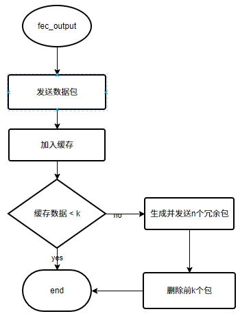

# Rudp 中前向纠错编码RS实现

[TOC]

## RS 编码简介
RS编码是一种前向纠错编码，通过在网络传输额外的冗余包，减少数据的重传。
`源数据包数量：K`
`冗余数据包数量：R`
**发送方每发送 K 个数据包，多发送 R 个冗余数据包。**
**接受方在收到 K+R 个中的任意 K 个数据包，即可还原出源数据包**。

## 通信协议头

```(c++)
struct ProtocolFecData {
    ProtocolHeader header;
    uint32_t sn;
    uint8_t channel;
    uint8_t K;
    uint8_t N;
    uint8_t Idx;
};
```
### 关键字段
**sn**: 序列号，用于标识数据包属于哪个编码组。
**K**：源数据包数量，即用于编码的数据包数量。
**N**：冗余数据包数量，即编码生成的数据包数量。
**Idx**：编码组索引，用于标识该数据包在编码组中的排序。

## 实现思路
### 发送端
#### 流程
1. 每发送一个数据包时将其加入缓存。
   1. 当缓存数量大于 K 时，对缓存中的数据进行RS编码，并将编码生成的冗余包发送给接收方，并清空缓存。



#### 发送端协议字段填充
发送端在发送数据包时，每k个源数据包（即相同编码组的数据包）和n个冗余包的sn号相同，Idx值为该数据包在编码组中的排序（0 <= Idx <= k+n-1）。

**源数据包处理**：


**冗余数据包处理**：


当解码完毕后，FecSN自增


### 接收端

#### 缓存结构：
```
struct fec_cache_t {
    int m_index;
    std::unordered_map<uint32_t, fec_group_t> m_seq2group;
    fec_data_t m_cache[FEC_CACHE_SIZE];
    anti_replay_t m_anti_replay;
    ...
}
```
**m_index**: 缓存中下一个存储位置的索引。
**m_seq2group**: 哈希表，用于存储sn与编码组的映射关系。
**m_cache**: 数据包缓存。
**m_anti_replay**: 记录过期序列号。

#### 编码组结构

编码组记录了数据包数量以及数据包缓存位置，通过该编码组的avail和total值，判断是否满足构建条件。
```
struct fec_group_t {
    uint32_t enc_len;
    int *idx2index;
    uint8_t K;
    uint8_t N;
    uint8_t avail;
    uint8_t total;
    ...
}
```
**enc_len**: 编码长度，在解码时需要将所有数据包拉长至编码长度。
**idx2index**：编码组索引映射到缓存索引。
**K**: 源数据包数量。
**N**: 冗余数据包数量。
**avail**: 编码组中已有的源数据包数量。
**total**: 编码组中所有数据包的总数。

#### 缓存数据

```
struct fec_data_t {
    uint32_t sn;
    char* buf;
    uint16_t len;
    uint8_t used;
    fec_data_t() : sn(0), used(0), len(0), buf(nullptr) {}
};
```
**sn**: 序列号，用于标识缓存数据属于哪个编码组。
**buf**：数据包内容。
**len**: 数据包长度。
**used**: 标识缓存中的数据是否生效。


#### 流程

1. 当收到一个包时，**判断其是数据包还是冗余包**。
   1. 若是数据包，则先将其上传。
2. 读取数据包头的sn号，**判断其是否过期**。
   1. 若过期，则丢弃该数据包。
   2. 若未过期，通过sn判断编码组是否存在。
      1. 若不存在，创建一个新的编码组
      2. 将数据加入m_cache中，编码组记录数据的存储位置，并修改编码组的avail和total值。
3. 判断编码组是否满足构建条件
   1. 若编码组收到所有源数据包
      1. 丢弃该编码组，并清空该编码组的数据包缓存。
      2. 设置sn号过期。
   2. 若编码组收到K个数据包
      1. 构建源数据包并上传。
      2. 设置sn号过期。


### 数据包的丢弃策略

#### 覆盖丢弃

缓存是采用覆盖策略来更新，当一个编码组中数据被覆盖时，则丢弃整个编码组，数据包的丢弃是以编码组为单位来丢弃，因为只丢弃编码组的一个数据，会导致数据包重复构建，导致浪费计算资源。考虑如下情况：

    K = 2 R = 2
    源数据包为 A B
    冗余数据包为 C D
    接收端先收到 A C，还原出源数据包B，并上传。
    此时A被覆盖丢弃，此时B数据包到达，触发数据包构建还原出以收到的数据包A，浪费了计算资源。

在缓存较大的情况下，当编码组中的数据包被覆盖时, 缓存也循环了一圈，若此时编码组若仍未被构建，很大情况下同一个编码组中的源数据包和冗余数据包在传输过程中丢失了，接收端没有在rto内收到数据包，此时很大可能已经触发了重传。

#### 收到K个源数据包丢弃

在所有源数据包都收到后，将整个编码组丢弃,并设置sn号过期。当后续相同sn号的冗余数据包到达时，则会忽略该数据包。   

#### 构建源数据包丢弃

当编码组满足构建条件并完成构建后，将整个编码组丢弃,并设置sn号过期，当收到后续相同sn号的冗余数据包和源数据包（**注意这里只是不将源数据包加入缓存，但源数据包仍会被上传**）时, 则会忽略该数据包。


## 数据统计

测试方法：在双向50ms延迟、10%乱序发送的情况下，分别在10%、20%、30%丢包率下各发送10000个数据包（数据包每隔10ms发送一次），统计五次后取平均值。

### 10%丢包率
#### avg rtt
 

#### 95% rtt


#### 99% rtt


#### 带宽消耗


### 20%丢包率
#### avg rtt


#### 95% rtt


#### 99% rtt


#### 带宽消耗


### 30%丢包率
#### avg rtt


#### 95% rtt


#### 99% rtt


#### 带宽消耗


## 结论
RS编码的本质即使用空间交换时间，提前发送冗余数据包，让接收端在丢失时可以自动构建源数据包，从而避免重传带来的时间延迟，但代价是消耗额外的带宽。比较理想的情况为消耗尽量少的带宽去换取更多的时延降低。

以下均为测试环境下得出的结论：
（50ms延迟、10%乱序，10%、20%、30%丢包率，发送10000个数据包，发送间隔为10ms）

* 在K固定的情况下，发送的冗余数据包越多，消耗的带宽越大，数据包延迟更低。

* 在丢包率相对较小的情况下（10%对比30%），在发送冗余包倍率相等的情况下（例如RS(2,2)与RS(4,4), 数据包和冗余包的倍率都为1:1），较小的K值的平均延迟比较低，因为较小的K能更快地构建并发送冗余包（文中RS的实现为发送数据包同时进行缓存，当缓存含有K个数据包后，发送N-K个冗余包，较小的K值数据包的累积速度较快）

### 关于R值的选择
对比10%丢包率下带宽消耗以及30%丢包率下的带宽消耗。

当丢包率为10%时，发送较少的冗余包即可构建源数据包，消耗带宽较少。
但当丢包率为30%时，发送较少的冗余包难以构建源数据包，因此导致重传，而重传数据包也会放入缓存，构建新的冗余包，故带宽消耗与直接发送多个冗余包相比十分接近。

**故在丢包率较高的情况下，应该直接启用较大的R值（发送冗余包的数量）**。

---

### 关于K值的选择
当K值较小时，发送冗余包的频率快，但冗余包的还原范围较小，。当K值较大时，发送冗余包的频率慢，但冗余包的还原范围较大。举例说明：
  * 当选择RS参数为(2,2)和RS参数为(4,4)，丢包为0.2，计算能够还原出所有包的概率

计算公式为：
\[ P(X \geq K) = \sum_{i=K}^{N} \binom{N}{i} \cdot q^i \cdot p^{N-i} \]
**K**：源数据包的数量；
**N**：源数据包和冗余数据包之和；
**p**：丢包率；

计算代码：
```(python)
from math import comb

def binomial_probability(n, k, p):
    q = 1 - p
    return comb(n, k) * (q ** k) * (p ** (n - k))

def calculate_at_least_k(n, k, p):
    probability = 0
    for i in range(k, n + 1):
        probability += binomial_probability(n, i, p)
    return probability

# 参数设定
# n = 4  # 总共发送的包数
# p = 0.2  # 丢包率
# k = 2  # 至少收到的包数

n = 8
p = 0.2
k = 4

probability = calculate_at_least_k(n, k, p)
print(f"在丢包率为 {p*100}% 的情况下，发送 {n} 个包中收到至少 {k} 个包的概率为 {probability:.4f}")
```

#### RS(2,2)
还原出所有数据包的概率为：
\[ P(X \geq 2) = \sum_{i=2}^{4} \binom{4}{i} \cdot q^i \cdot p^{4-i} = 0.9728\]

#### RS(4,4)
还原出所有数据包的概率为：
\[ P(X \geq 4) = \sum_{i=4}^{8} \binom{8}{i} \cdot q^i \cdot p^{8-i} = 0.9896\]

可以看出，在相同冗余包倍率的情况下，更大的 K 值拥有更低的丢包率，既然这么，岂不是无脑选择更大的K值即可。

然而事实并非如此，我们仍需要考虑累计K个数据包的时间，当K值较小时，发送端能更快地发送冗余包，接收方能更快的还原源数据包，从而降低传输时延。

**想象一个极端情况，当我们将K设置为100时，发送端需要凑够100个源数据包才发送冗余数据包，而当接受端收到所有冗余数据包时，需要构建的源数据包已经发生重传了...如此Fec反倒失去了作用。**

#### 结论

那我们应该依据什么原则设定K值呢?
做出以下假设：
* interval：数据包平均发送间隔
* delay：数据包发送时延
* RTO：数据包重传触发时间

需要保证
\[ interval \cdot k + delay << RTO \]