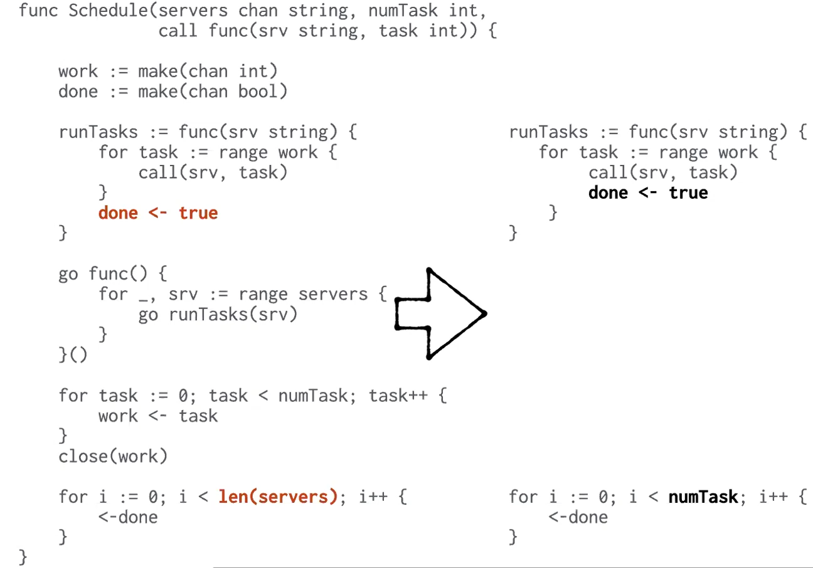
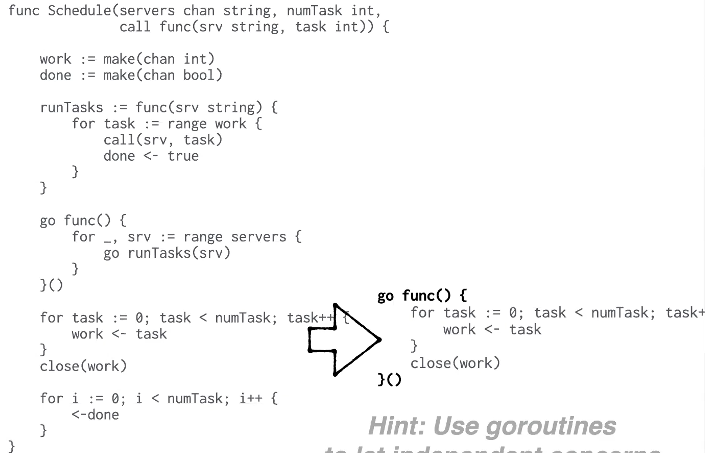
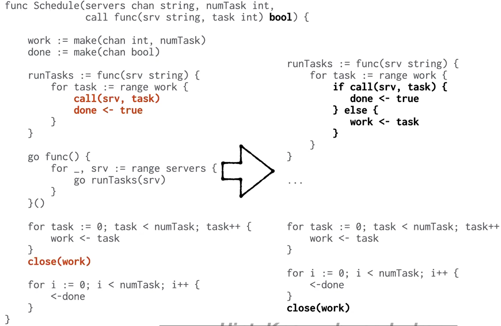

# Patterns and Hints for Concurrency in Go

1. Use the race detector,for development and even production.
   1. 在开发生产环境中使用竞争检测器
2. Convert data state into code state when it makes programs clearer.
   1. 在能简化程序理解的前提下，同一个程序的代码实现，可以考虑**将数据状态转变成代码状态**
3. Convert mutexes into goroutines when it makes programs clearer.
   1. 在能简化程序理解的前提下，可以使用 goroutine 替代互斥量。
4. Use additional goroutines to hold additional code state.
   1. **可以通过启动新的goroutine来存储code state代码状态**
5. Use goroutines to let independent concerns run independently.
   1. 使用 goroutines 将程序中重要的部分分离。
6. Consider the effect of slow goroutines.
   1. 考虑运行缓慢 goroutines 对程序造成的影响。
7. Know why and when each communication will proceed.
   1. 了解程序能持续运行的条件
8. Know why and when each goroutine will exit.
   1. 了解每个 goroutine 的结束条件
9. Type Ctrl-\to kill a program and dump all its goroutine stacks.
10. Use the HTTP server's /debug/pprof/goroutine to inspect live goroutine stacks.
11. Use a buffered channel as a concurrent blocking queue.
    1. 将带有缓冲区 channel 作为一个并发阻塞队列。
12. Think carefully before introducing unbounded queuing.
13. Close a channel to signal that no more values will be sent.
    1. 关闭一个 channel 代表不会再发送任务数据。
14. Stop timers you don't need.
    1. 及时释放不需要的定时器。
15. Prefer defer for unlocking mutexes.
    1. 使用 defer 来保证互斥量的释放
16. Use a mutex if that is the clearest way to write the code.
17. Use a goto if that is the clearest way to write the code.
18. Use goroutines,channels,and mutexes together if that is the clearest way to write the code.

## 发布/订阅模式

以发布订阅服务器的代码实现举例，大意就是原本的发布订阅相关的方法中，需要用mutex保护临界区map的读写，会有频繁的加锁、解锁流程。

**hint**：think carefully before introducing unbounded queuing.

原先的代码通过锁来维护订阅列表的添加和删除，现在通过 select 循环实现从而避免锁
的竞争，利用channel代替锁的功能，channel本身会阻塞直到读写方都准备好，且调用者通过读取传入的 channel 得到返回值。

上述代码通过 select 循环和 channel 维护了订阅队列，但是对于 publish 无法做到细粒度的控制。这里的做法是为每个订阅者新建 helper goroutine 来解耦 loop 循环和 publish 发布。**通过使用 goroutine 可以将代码中关注点分离，并在每个 goroutine 中去解决关键问题**

## Work scheduler(工作调度器)

修复bug：闭包调用会导致每一个 call 函数使用相同的task

大多数时候任务数量大于服务器数量，仅在有空闲服务器时，创建一个goroutine，这样可以避免创建多个阻塞的 goroutine（占用系统资源）

为每个server创建一个 goroutine 而非为每个task创建goroutine（这个和线程池的思想很像，可以减少创建、销毁线程的开销）。
将 servers 的数据结构**从数组变为channel**，并且开启一个goroutine循环读取server，使得可以动态加入新 server 工作。

完善代码：根据 task 数量回复 done 而非 server 数量

完善代码：当任务数量大于 server 数量时会造成死锁，server会阻塞在 `done <- true`，可以通过**新建一个 goroutine 来完成发布任务的工作或者增加 channel 缓冲区容量解决**。（hints：**了解每个 goroutine 的运行状态**）

完善代码：**当任务调用失败时将其返回work队列**，**关闭 channel 代表停止发送数据**，由于任务调用可能会失败导致 task 返回队列，这里要等到所有 task 都完成后再关闭 work channel。

完善代码：**确保每个goroutine合理的退出**

## 复制服务的客户端(Replicated service client)

客户端调用接口，该接口拥有一组可调用的服务器以及一个远程调用方法，**用户在使用调用方法时不用关心对服务器的调用细节**（例如选择哪个服务器，调用超时重新发送请求...）

为 done channel 提供足够的缓冲区来保证服务调用返回时不会阻塞，作为用户只关心第一个返回的结果，多余的返回内容交由 GC 清理。

**当使用 goto 可以使代码更清晰时不要介意使用它**。

## 协议选择器(protocol multiplexer)

一个类似于 **epoll 的 I/O 多路复用**接口

使用 Readtag 将消息映射成唯一的 tag，并使用 map 将 tag 与返回结果的 channel 作映射，在返回结果时，根据 tag 选择相应的 channel 返回结果。
这里要注意的是，**对于消息和返回结果，readtag 必须将其映射到相同且唯一的 tag 上**。

